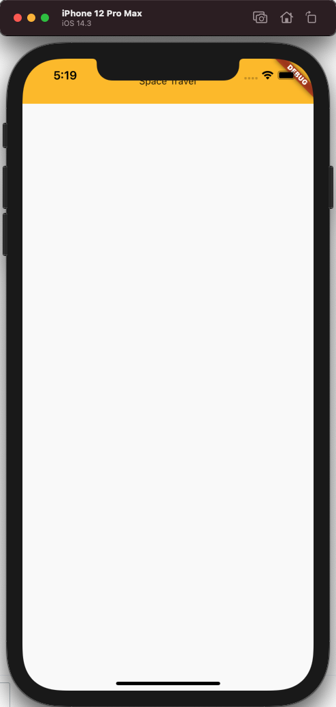
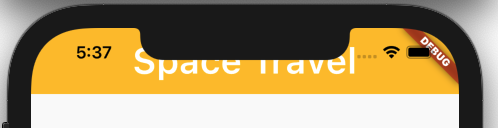
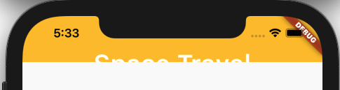
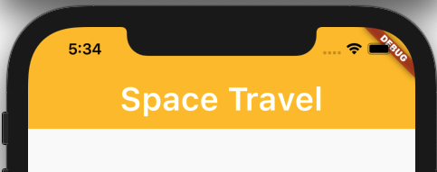
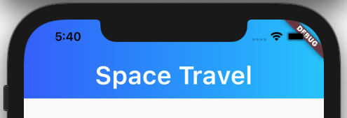

# 创建应用栏
## 创建最小的应用
```dart
import 'package:flutter/material.dart';

void main() => runApp(MyApp());


class MyApp extends StatelessWidget {
  @override
  Widget build(BuildContext context) {
    return MaterialApp(
      title: "Flutter Demo",
      home: new Center(
        child: new Text("data"),
      ),
    );
  }
}
```
## 创建目录结构
```dart
- lib
  - main.dart
  - page
    - HomePage.dart   // 主页
    - GradienAppBar.dart  // Appbar
    - Page.dart  // 将所有库导出
```
## HomePage
```dart
import 'package:flutter/material.dart';
import 'package:space_travel/page/GradienAppBar.dart';


class HomePage extends StatelessWidget {
  @override
  Widget build(BuildContext context) {
    return Scaffold(
      body: new Column(
        children: <Widget>[
          new GradienAppBar("Space Travel")
        ],
      ),
    );
  }
}
```
## GradienAppBar
创建一个自定义的AppBar
```dart
import 'package:flutter/material.dart';


class GradienAppBar extends StatelessWidget {
  final String title;
  final double barHeight = 66.0;

  GradienAppBar(this.title);
  @override
  Widget build(BuildContext context) {
    return Container(
      height: barHeight,
      decoration: BoxDecoration(color: Colors.amber),
      child: new Center(
        child: new Text(title),
      ),
    );
  }
}
```

## Page
为了引用包不需要每个文件都引，我们采用了下面的方式，就可以直接导出一个就完成了。
```dart
import 'package:space_travel/page/HomePage.dart';
import 'package:space_travel/page/GradienAppBar.dart';


export 'package:space_travel/page/Page.dart';
```

## Main
```dart
import 'package:flutter/material.dart';
import 'package:space_travel/page/HomePage.dart';
import 'package:space_travel/page/Page.dart';

void main() => runApp(MyApp());


class MyApp extends StatelessWidget {
  @override
  Widget build(BuildContext context) {
    return MaterialApp(
      title: "Flutter Demo",
      home: new HomePage(),
    );
  }
}
```

## 字体、大小和颜色
[字体](https://fonts.google.com/specimen/Poppins?preview.text_type=custom)  
```yaml
- lib
- assets
  - fonts
  - img
```
将以下行添加到您的 pubspec.yaml：
```yaml
  fonts:
    - family: Poppins
      fonts:
        - asset: assets/fonts/Poppins-SemiBold.ttf
          weight: 600
```
现在，我们添加了字体，我们可以使用它创建一个文本样式,更改标题对象.
```dart
class GradienAppBar extends StatelessWidget {
  final String title;
  final double barHeight = 66.0;

  GradienAppBar(this.title);
  @override
  Widget build(BuildContext context) {
    return Container(
      height: barHeight,
      decoration: BoxDecoration(color: Colors.amber),
      child: new Center(
        child: new Text(
            title,
          style: const TextStyle(
            color: Colors.white,
            fontFamily: "Poppins",
            fontWeight: FontWeight.w600,
            fontSize: 36.0
          ),
        ),
      ),
    );
  }
}
```
## 条形尺寸

如果检查上一个屏幕截图，您将意识到文本完全居中，但是，屏幕从手机的状态栏后面开始，因此我们不必计算此空间以进行居中或调整大小。这在 Flutter 中很容易实现。在类声明中添加以下行：
```dart
// 获取状态栏的高度
final double statusBarHeight = MediaQuery
  .of(context)
  .padding
  .top;
```
并修改容器以将状态栏高度添加到所需高度并填充它：
```dart
padding: new EdgeInsets.only(top: statusBarHeight),
```

```dart
height: barHeight + statusBarHeight,
```

```dart
import 'package:flutter/material.dart';


class GradienAppBar extends StatelessWidget {
  final String title;
  final double barHeight = 66.0;

  GradienAppBar(this.title);
  @override
  Widget build(BuildContext context) {
    final double statusBarHeight = MediaQuery
        .of(context)
        .padding
        .top;
    return Container(
      padding: new EdgeInsets.only(top: statusBarHeight),
      height: barHeight + statusBarHeight,
      decoration: BoxDecoration(color: Colors.amber),
      child: new Center(
        child: new Text(
            title,
          style: const TextStyle(
            color: Colors.white,
            fontFamily: "Poppins",
            fontWeight: FontWeight.w600,
            fontSize: 36.0
          ),
        ),
      ),
    );
  }
}
```
## 渐变背景
最后一部分是实现渐变背景。我们只需要通过删除颜色属性并设置渐变属性来更改 BoxDecoration，这样：
```dart
decoration: BoxDecoration(
        gradient: new LinearGradient(
          colors: [
            const Color(0xFF3366FF),
            const Color(0xFF00CCFF),
          ],
            begin: const FractionalOffset(0.0, 0.0),
            end: const FractionalOffset(1.0, 0.0),
            stops: [0.0, 1.0],
            tileMode: TileMode.clamp
        )
      ),
```
  
`LinearGradient`参数很容易理解：

colors：渐变中使用的颜色数组，本例中为两种蓝色色调。  
begin，end：第一种颜色和最后一种颜色的位置，在这种情况下，允许我们将坐标视为 x 和 y 的 0 到 1 的范围。由于我们想要水平渐变，我们对两个度量值使用相同的 Y，x 从 0.0（左）到 1.0（右）变化。`FractionalOffset`  
stops：此数组的大小应与颜色相同。它定义颜色的分布。{0.0， 1.0} 将从左到右填充它。{0.0， 0.5} 将填充从左到右到半条的颜色，等等。  
tileMode：如果停靠点未填满整个区域，该怎么办。在这种情况下，我们添加了夹紧（它将重用使用的最后一种颜色），但当我们的渐变从 0.0 到 1.0 时，它并不真正必要。
