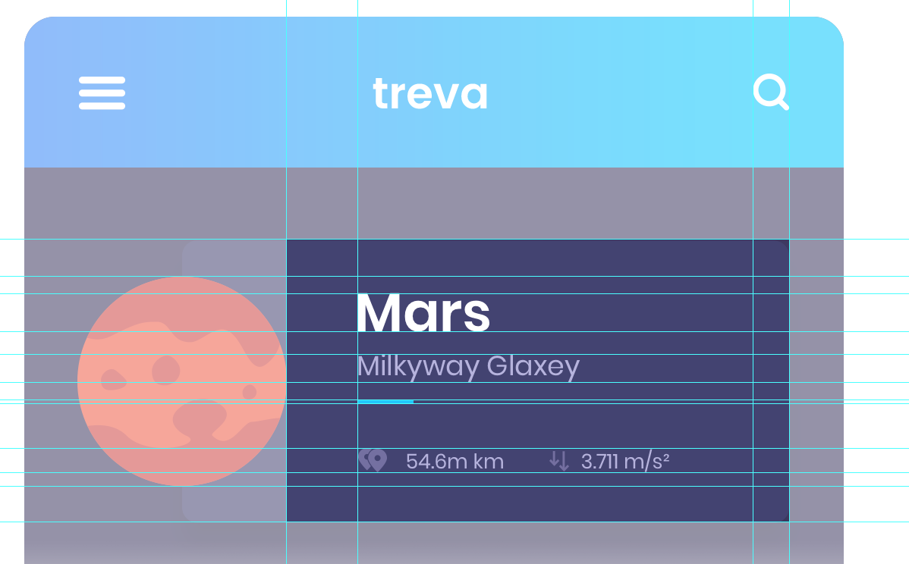

# 向卡片添加内容
## 创建数据源
由于行星列表是静态的，并且数据不会改变，因此从代码创建此信息就足够了。  
首先，我们创建一个类来保存单个行星的信息：  
```dart
class Planet {
  final String id;
  final String name;
  final String location;
  final String distance;
  final String gravity;
  final String description;
  final String image;

  const Planet({
    this.id,
    this.name,
    this.location,
    this.distance,
    this.gravity,
    this.description,
    this.image,
  });
}

List<Planet> planets = [
  const Planet(
    id: "1",
    name: "Mars",
    location: "Milkyway Galaxy",
    distance: "54.6m Km",
    gravity: "3.711 m/s ",
    description: "Lorem ipsum...",
    image: "assets/img/mars.png",
  ),
  const Planet(
    id: "2",
    name: "Neptune",
    location: "Milkyway Galaxy",
    distance: "54.6m Km",
    gravity: "3.711 m/s ",
    description: "Lorem ipsum...",
    image: "assets/img/neptune.png",
  ),
  const Planet(
    id: "3",
    name: "Moon",
    location: "Milkyway Galaxy",
    distance: "54.6m Km",
    gravity: "3.711 m/s ",
    description: "Lorem ipsum...",
    image: "assets/img/moon.png",
  ),
  const Planet(
    id: "4",
    name: "Earth",
    location: "Milkyway Galaxy",
    distance: "54.6m Km",
    gravity: "3.711 m/s ",
    description: "Lorem ipsum...",
    image: "assets/img/earth.png",
  ),
  const Planet(
    id: "5",
    name: "Mercury",
    location: "Milkyway Galaxy",
    distance: "54.6m Km",
    gravity: "3.711 m/s ",
    description: "Lorem ipsum...",
    image: "assets/img/mercury.png",
  ),
];
```
## 所有行星
```dart
class PlanetRow extends StatelessWidget {
  final Planet planet;

  PlanetRow(this.planet);
}
```
```dart
 Widget _planetThumbnail() {
    return Container(
      margin: EdgeInsets.symmetric(vertical: 16.0),
      alignment: FractionalOffset.centerLeft,
      child: new Image(
        image: new AssetImage(planet.image),
        height: 92.0,
        width: 92.0,
      ),
    );
  }
```
```dart
class HomePageBody extends StatelessWidget {
  @override
  Widget build(BuildContext context) {
    return new PlanetRow(planets[0]);
  }
}
```
## 一张可爱的卡片
由于我们将使用三种不同的文本样式，我们将将它们创建为常量，并在以后重用它们。
### 文本样式
```yaml
fonts:
    - family: Poppins
      fonts:
        - asset: assets/fonts/Poppins-SemiBold.ttf
          weight: 600
        - asset: assets/fonts/Poppins-Regular.ttf
          weight: 400

```
由于我们所有的文本样式都使用相同的字体，我们可以创建一个基本样式，指示字体：
```dart
final baseTextStyle = const TextStyle(
      fontFamily: 'Poppins'
    );
```
现在，我们可以创建复制基本样式的标头样式：
```dart
final headerTextStyle = baseTextStyle.copyWith(
      color: const Colors.white,
      fontSize: 18.0,
      fontWeight: FontWeight.w600
    );

final regularTextStyle = baseTextStyle.copyWith(
  color: const Color(0xffb6b2df),
  fontSize: 9.0,
  fontWeight: FontWeight.w400
);

final subHeaderTextStyle = regularTextStyle.copyWith(
    fontSize: 12.0
);
```
## 内容

