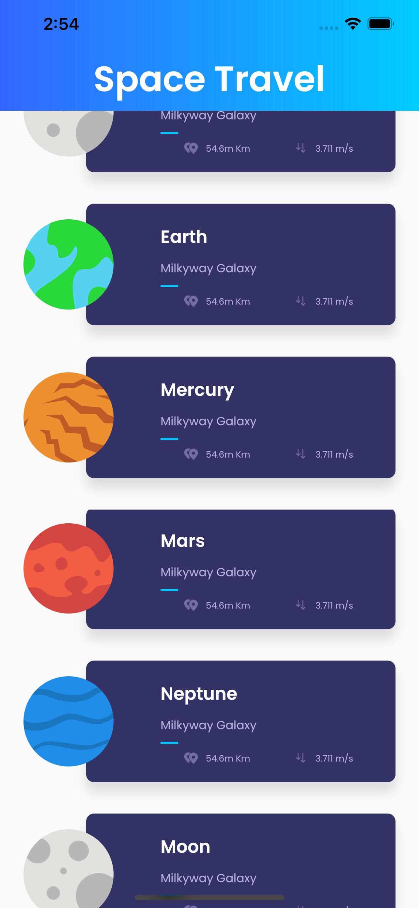
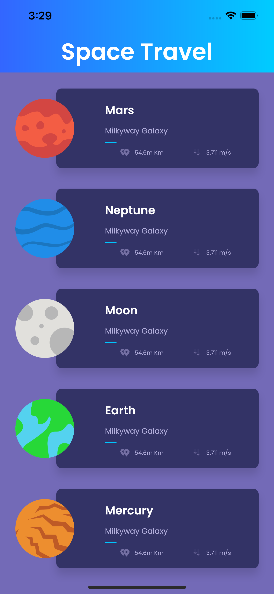

# 创建行星列表
## 制作列表
Flutter 使用 ListView 小部件创建列表和可滚动项目。很容易认为它就像 Android ListView/回收器视图组件， 但事实上， 它最类似于滚动视图。您可以使用这样的静态项目创建列表：
```dart
new ListView(
  children: Widget<>[
    new Item1(),
    new Item2(),
    new Item3()
  ]
)
```
在动态列表的情况下，我们将使用构造函数 。它需要几个额外的参数，而不是简单列表视图：ListView.builder()  
`itemCount`：要在列表中显示的项目数  
`itemBuilder`：负责创建每行的类型函数。它接收当前上下文和项索引，并且必须返回要显示的 IndexedWidgetBuilder。  
`itemExtent`：我们可以设置行的大小。如果所有行的大小相同，这将加快项目的绘制速度。 

```dart
class HomePageBody extends StatelessWidget {
  @override
  Widget build(BuildContext context) {
    return new ListView.builder(
        itemBuilder: (context,index) => new PlanetRow(planets[index]),
      itemCount: planets.length,
      itemExtent: 152.0,
    );
  }
}
```  
```dart
class HomePage extends StatelessWidget {
  @override
  Widget build(BuildContext context) {
    return Scaffold(
      body: new Column(
        children: <Widget>[
          new GradienAppBar("Space Travel"),
          new HomePageBody()
        ],
      ),
    );
  }
}
```
但是，这行不通。

控制台将给我们一条这样的消息：
```dart
The following assertion was thrown during performResize():
Vertical viewport was given unbounded height.
Viewports expand in the scrolling direction to fill their container.In this case, a vertical
viewport was given an unlimited amount of vertical space in which to expand. This situation
typically happens when a scrollable widget is nested inside another scrollable widget.
If this widget is always nested in a scrollable widget there is no need to use a viewport because
there will always be enough vertical space for the children. In this case, consider using a Column
instead. Otherwise, consider using the "shrinkWrap" propery (or a ShrinkWrappingViewport) to size
the height of the viewport to the sum of the heights of its children.
```  
问题是 ListView 无法计算自己的高度（主要是因为`HomePagebody`小部件位于`Column`中。解决方案是将 ListView 放在具有指定高度的容器中，但是，此高度在每个设备上可能不同。我们可以计算它，但有一个更好的解决方案。  
```dart
class HomePageBody extends StatelessWidget {
  @override
  Widget build(BuildContext context) {
    return new Expanded(
        child: new ListView.builder(
      itemBuilder: (context, index) => new PlanetRow(planets[index]),
      itemCount: planets.length,
      itemExtent: 152.0,
    ));
  }
}
```
扩展小部件在计算具有特定大小的小部件的大小后，会占用所有剩余空间，因此，它能够为 ListView 提供适当的大小。

无法计算高度或宽度的小部件（名为无边界高度/宽度）是您从 Flutter 开始时要面对的常见问题。我们将保持简单，因为这是一个主题，值得一篇文章本身。

现在你有一个不错的可滚动的行星列表，一切看起来都很好，但有一点丢失。

还记得我们创建行星行的时候吗？我们说所有行的分离为 32dp，包括第一行的上边距和最后一行的下边距。我们决定将每行的 16dp 的边距设置为顶部和底部。这使得行之间分离 32 dp，但第一项顶部边距和最后一个项目底部边距只有 16dp。

让我们来解决这个问题，我们只需要将填充属性添加到构造函数中：
```dart
class HomePageBody extends StatelessWidget {
  @override
  Widget build(BuildContext context) {
    return new Expanded(
        child: new ListView.builder(
            itemBuilder: (context, index) => new PlanetRow(planets[index]),
            itemCount: planets.length,
            padding: new EdgeInsets.symmetric(vertical: 16.0)));
  }
}
```

## 输入Slivers
Slivers是一段可滚动的内容。Slivers应放置在 ScrollView 小部件中。创建 ScrollView 的基本类是允许作为子级显示的 Sliver 列表。有几个 ScrollView 类，查看所有这些类超出了本文的范围。CustomScrollView

也有几个Slivers，这些是其中一些：

`SliverAppBar`：用于创建可折叠材料 AppBar。
`SliverList`：项的线性列表。
`SliverFixedExtentList`： 与上一个类似，但对于具有固定高度的项目。
`SliverToBoxAdapter`： 具有定义大小的单个子项的薄片。
`SliverPadding`： 一个简单的薄片， 包含安托赫薄片， 并允许我们应用填充。
```dart
class HomePageBody extends StatelessWidget {
  @override
  Widget build(BuildContext context) {
    return new Expanded(
      child: new Container(
        color: new Color(0xFF736AB7),
        child: new CustomScrollView(
            scrollDirection: Axis.vertical,
            shrinkWrap: false,
            slivers: <Widget>[
              new SliverPadding(
                padding: const EdgeInsets.symmetric(vertical: 24.0),
                sliver: new SliverList(
                  delegate: new SliverChildBuilderDelegate(
                    (context, index) => new PlanetRow(planets[index]),
                    childCount: planets.length,
                  ),
                ),
              )
            ]),
      ),
    );
  }
}
```
