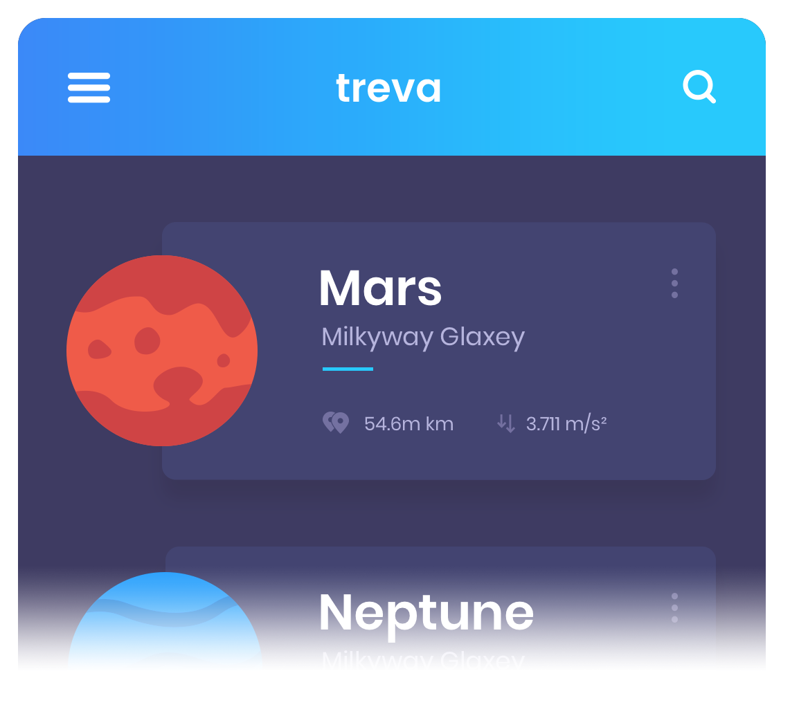
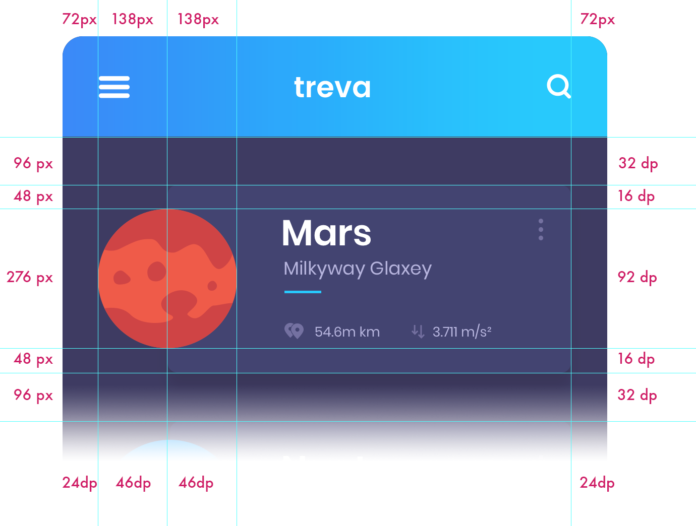
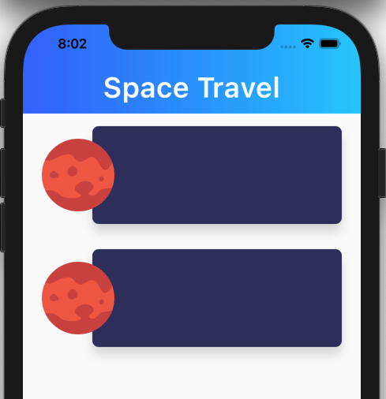

# 行星卡

## 度量和密度
原始设计是 psd 文件，屏幕分辨率为 1080 x 1800。如果我们在设备指标网站上查看，我们可以看到具有 1080 x 1920（我们的屏幕大小加上状态栏或更少）的移动设备的密度大多为 3.0 和大约 2.6。因此，为了简单起见，我们将使用 3 作为密度因子。这意味着我们将将所有度量值除以 3 以从像素转换为 dp。

顶部和左侧的数字是像素的度量，底部和右侧的数字是 dp 中的度量值。

因此，让我们回到我们最后的代码，并从那里工作。在类中，我们将新元素添加到正文中：`HomePage` `Column` `Scaffold`

创建文件 HomePageBody.dart，让我们用基本结构来创建它：
```dart
import 'package:flutter/material.dart';
import 'package:space_travel/page/Page.dart';


class HomePageBody extends StatelessWidget {
  @override
  Widget build(BuildContext context) {
    return new PlanetRow();
  }
}
```  
同样，我们只是放置一个类型行星罗的元素和导入文件PlanetRow.dart。现在，我们可以用一个简单的基础创建它：
```dart
import 'package:flutter/material.dart';


class PlanetRow extends StatelessWidget {
  @override
  Widget build(BuildContext context) {
    return new Container();
  }
}
```
## 边界
我们将按照设计指示设置容器的边距，左侧和右侧为 24 dp，顶部和底部为 16 dp。请记住，单元格之间的分离是 32 dp，但当我们将它们堆积起来时，我们需要在每张卡的底部边框和下一张单元格的顶部边框之间共享这种分离，以加起来 32 dp。
```dart
class PlanetRow extends StatelessWidget {
  @override
  Widget build(BuildContext context) {
    return new Container(
      margin: const EdgeInsets.only(
        top: 16.0,
        bottom: 16.0,
        left: 24.0,
        right: 24.0
      ),
    );
  }
}
```
`EdgeInsets` 是一个将生成应用边距的类。它有一些花哨的构造函数：

`EdgeInsets.only(left, top, right, bottom)`： 允许我们定义每边不同的边距。它们都是可选的，因此您可以指定，例如，仅左侧和顶部。  
`EdgeInsets.fromLTRB(left, top, right, bottom)`：与之前类似，但是，您必须使用位置参数指定四个边距。LTRB 是一个 nmemonic 规则（左、上、右、下）。  
`EdgeInsets.all(value)`：为所有四面设置相同的边距。  
`EdgeInsets.symmetric(vertical, horizontal)`：允许我们使用单个值指定顶部/底部和/或左/右。  
在这种情况下，我们的边距是对称的，因此我们可以将边距更改为:
```dart
class PlanetRow extends StatelessWidget {
  @override
  Widget build(BuildContext context) {
    return new Container(
      margin: const EdgeInsets.symmetric(
        vertical: 16.0,
          horizontal: 24.0
      ),
    );
  }
}
```
## 设置行
该行由两个对象组成，行星图像和带文本的蓝色矩形。当行星与矩形重叠时，组织它们的最佳方法就是将它们放入小部件中。小部件只是将元素之一放在 z 轴中另一个元素的顶部。
```dart
return new Container(
      margin: const EdgeInsets.symmetric(
        vertical: 16.0,
          horizontal: 24.0
      ),
      child: new Stack(
        children: <Widget>[
          _planetCard(),
          _planetThumbnail(),
        ],
      ),
    );
```
## 行星缩略图
只是一个简单的图像。我们将把它放在assets/img文件夹中，并在 pubspec.yaml 中声明：
```yaml
assets:
    - assets/img/mars.png
```
现在，我们可以使用设计中的大小和边距声明它。
```dart
Widget _planetThumbnail() {
    return Container(
      margin: EdgeInsets.symmetric(vertical: 16.0),
      alignment: FractionalOffset.centerLeft,
      child: new Image(image: new AssetImage("assets/img/mars.png"),height: 92.0,width: 92.0,),
    );
}
```
## 装饰卡片
```dart
Widget _planetCard() {
    return Container(
      height: 124.0,
      margin: EdgeInsets.only(left: 64.0),
      decoration: new BoxDecoration(
          color: new Color(0xFF333366),
          shape: BoxShape.rectangle,
          borderRadius: new BorderRadius.circular(8.0),
          boxShadow: <BoxShadow>[
            new BoxShadow(
              color: Colors.black12,
              blurRadius: 10.0,
              offset: new Offset(0.0, 10.0),
            )
          ]),
    );
  }
```
## HomePage
```dart
class HomePage extends StatelessWidget {
  @override
  Widget build(BuildContext context) {
    return Scaffold(
      body: new Column(
        children: <Widget>[
          new GradienAppBar("Space Travel"),
          new HomePageBody(),
          new HomePageBody(),
        ],
      ),
    );
  }
}
```
