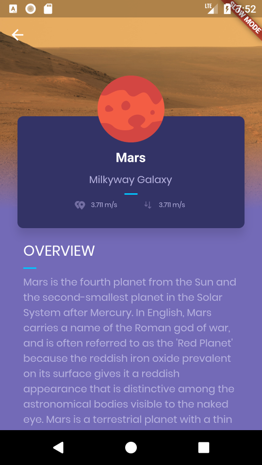
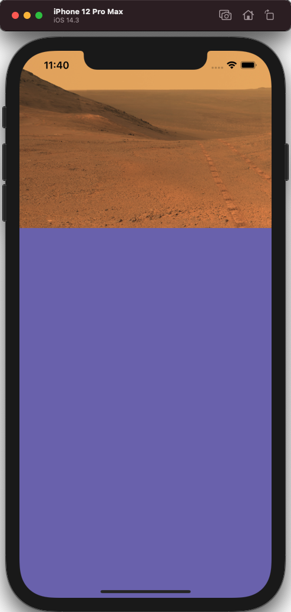
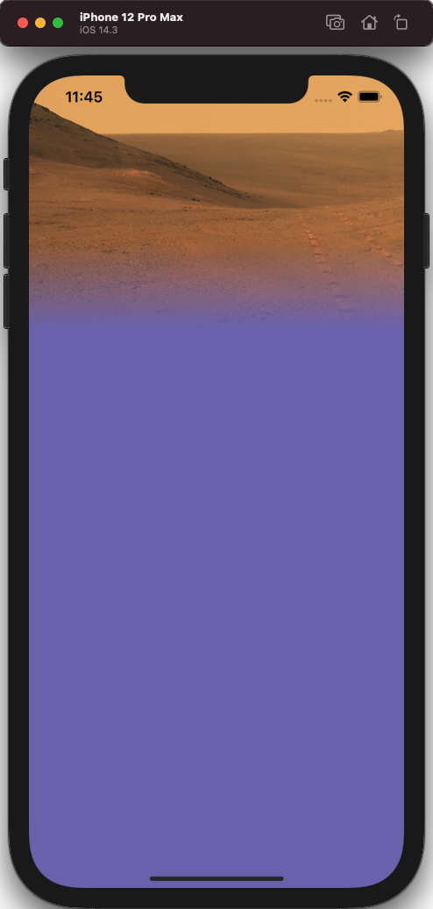
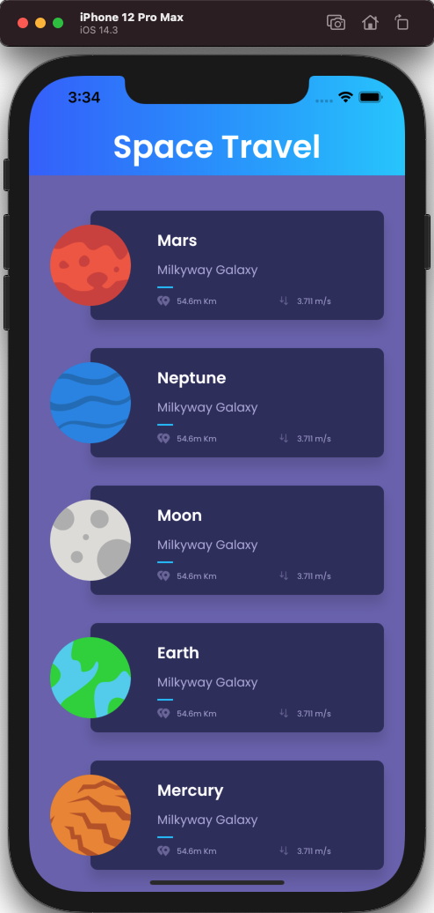
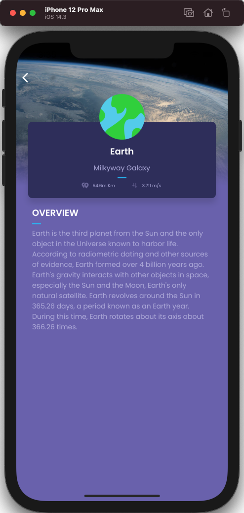

# 行星细节页面
> 这就是我们想要实现的  

  

本页将有四个主要组件：
- 背景图像
- 背景图像和背景颜色之间的渐变
- 内容本身，应该是可滚动的
- 顶部的后退按钮  
```dart
class DetailPage extends StatelessWidget {
  final Planet planet;

  DetailPage(this.planet);

  @override
  Widget build(BuildContext context) {
    return new Scaffold(
      body: new Container(
        color: const Color(0xFF736AB7),
        constraints: new BoxConstraints.expand(),
        child: new Stack(
          children: <Widget>[
            _getBackground(),
            _getGradient(),
            _getContent(),
            _getToolbar(context),
          ],
        )
      )
    );
  }
}
```  
我们只是定义一个只有一个带容器的新功能，用于两个基本方面：

- 设置为约束。一旦我们拥有了所有组件，我们就可以删除它，因为内容的滚动已经展开内容，但是，在创建背景和渐变时，使用此约束将使容器使用所有屏幕，而不是被剪切为图像大小。BoxConstrains.expand()

- 将背景颜色设置为0xFF736AB7。作为练习，也许一个好主意，分组所有颜色在一个单一的文件，因为我们对文本样式。  
## 新增数据
```dart
List<Planet> planets = [
  const Planet(
    id: "1",
    name: "Mars",
    location: "Milkyway Galaxy",
    distance: "54.6m Km",
    gravity: "3.711 m/s ",
    description: "Mars is the fourth planet from the Sun and the second-smallest planet in the Solar System after Mercury. In English, Mars carries a name of the Roman god of war, and is often referred to as the 'Red Planet' because the reddish iron oxide prevalent on its surface gives it a reddish appearance that is distinctive among the astronomical bodies visible to the naked eye. Mars is a terrestrial planet with a thin atmosphere, having surface features reminiscent both of the impact craters of the Moon and the valleys, deserts, and polar ice caps of Earth.",
    image: "assets/img/mars.png",
    picture: "https://www.nasa.gov/sites/default/files/thumbnails/image/pia21723-16.jpg"
  ),
  const Planet(
    id: "2",
    name: "Neptune",
    location: "Milkyway Galaxy",
    distance: "54.6m Km",
    gravity: "3.711 m/s ",
    description: "Neptune is the eighth and farthest known planet from the Sun in the Solar System. In the Solar System, it is the fourth-largest planet by diameter, the third-most-massive planet, and the densest giant planet. Neptune is 17 times the mass of Earth and is slightly more massive than its near-twin Uranus, which is 15 times the mass of Earth and slightly larger than Neptune. Neptune orbits the Sun once every 164.8 years at an average distance of 30.1 astronomical units (4.50×109 km). It is named after the Roman god of the sea and has the astronomical symbol ♆, a stylised version of the god Neptune's trident",
    image: "assets/img/neptune.png",
    picture: "https://www.nasa.gov/sites/default/files/styles/full_width_feature/public/images/110411main_Voyager2_280_yshires.jpg"
  ),
  const Planet(
    id: "3",
    name: "Moon",
    location: "Milkyway Galaxy",
    distance: "54.6m Km",
    gravity: "3.711 m/s ",
    description: "The Moon is an astronomical body that orbits planet Earth, being Earth's only permanent natural satellite. It is the fifth-largest natural satellite in the Solar System, and the largest among planetary satellites relative to the size of the planet that it orbits (its primary). Following Jupiter's satellite Io, the Moon is second-densest satellite among those whose densities are known.",
    image: "assets/img/moon.png",
    picture: "https://farm5.staticflickr.com/4086/5052125139_43c31b7012.jpg"
  ),
  const Planet(
    id: "4",
    name: "Earth",
    location: "Milkyway Galaxy",
    distance: "54.6m Km",
    gravity: "3.711 m/s ",
    description: "Earth is the third planet from the Sun and the only object in the Universe known to harbor life. According to radiometric dating and other sources of evidence, Earth formed over 4 billion years ago. Earth's gravity interacts with other objects in space, especially the Sun and the Moon, Earth's only natural satellite. Earth revolves around the Sun in 365.26 days, a period known as an Earth year. During this time, Earth rotates about its axis about 366.26 times.",
    image: "assets/img/earth.png",
    picture: "https://www.nasa.gov/sites/default/files/styles/full_width_feature/public/thumbnails/image/iss042e340851_1.jpg"
  ),
  const Planet(
    id: "5",
    name: "Mercury",
    location: "Milkyway Galaxy",
    distance: "54.6m Km",
    gravity: "3.711 m/s ",
    description: "Mercury is the smallest and innermost planet in the Solar System. Its orbital period around the Sun of 88 days is the shortest of all the planets in the Solar System. It is named after the Roman deity Mercury, the messenger to the gods.",
    image: "assets/img/mercury.png",
    picture: "https://c1.staticflickr.com/9/8105/8497927473_2845ae671e_b.jpg"
  ),
];
```
## 背景图像
所有使用的图像都受美国宇航局版权保护。

现在我们需要把图像放到位。我们想要的图像适合 300dp 高度和整个屏幕宽度。  
```dart
Widget _getBackground() {
    return new Container(
      child: new Image.network(planet.picture,fit: BoxFit.cover,height: 300.0,),
      constraints: new BoxConstraints.expand(height: 300.0),
    );
  }
```  
首先，我们创建一个带约束的 ，以尽可能扩展保持 300dp 的高度。`Container`

其次，我们使用对象。此构造函数是一种从 URL 加载图像的快速方法。我们还将高度设置为 300dp，将拟合参数设置为 。此约束可确保下载的图像将覆盖所有小部件，尽可能使用最小的图像，无论图像的方向如何，这都有效。我建议你玩不同的价值观， 以了解它们是如何工作的。`Image.networkBoxFit.coverBoxFit`  
  
## 背景渐变  
我们希望在图像顶部添加一个漂亮的渐变，以从图片过渡到背景颜色。取消注释行并复制以下代码：`_getGradient()`  
```dart
  Widget _getGradient() {
    return new Container(
      margin: new EdgeInsets.only(top: 190.0),
      height: 110.0,
      decoration: new BoxDecoration(
        gradient: new LinearGradient(
          colors: <Color>[
            new Color(0x00736AB7),
            new Color(0xFF736AB7)
          ],
          stops: [0.0, 0.9],
          begin: const FractionalOffset(0.0, 0.0),
          end: const FractionalOffset(0.0, 1.0),
        )
      ),
    );
  }
```
这与我们在工具栏章上做的渐变非常相似。我们添加了一个顶部边距，使其适合图像底部，实现顶部边距和高度加起来为 300dp，图像的确切高度。我们还使用 0.0 和 0.9 作为停靠点，使渐变达到 90% 的实体部分，否则图像的边框仍然稍微明显。  
  
## 内容
现在的很大一部分，内容本身。它将可滚动在图像和渐变的顶部，因此初始代码将像这样：
```dart
 Widget _getContent() {
    return ListView(
      padding: new EdgeInsets.fromLTRB(0.0, 72.0, 0.0, 32.0),
      children: <Widget>[],
    );
  }
```  
这是使内容可滚动的简单方法。我们在图像从上到左空间的 72dp 和底部的 32dp 上添加一个填充，以添加一个不错的列表结尾。
ListView 的内容有两个主要部分：顶卡和文本本身。如果我们分析顶卡，我们意识到与我们为主列表创建的卡片非常相似。最大的区别是行星缩略图位于顶部，而不是左侧，并且一些边距和对齐方式不同。  
我已经把PlanetRow类改名为PlanetSummary。这是更改行不同的结果代码：
```dart
import 'package:flutter/material.dart';
import 'package:space_travel/model/Planet.dart';
import 'package:space_travel/model/StyleValue.dart';
import 'package:space_travel/page/Page.dart';

class PlanetSummary extends StatelessWidget {
  final Planet planet;
  final bool horizontal;

  PlanetSummary(this.planet, {this.horizontal = true});

  PlanetSummary.vertical(this.planet) : horizontal = false;

  @override
  Widget build(BuildContext context) {
    return new GestureDetector(
      onTap: horizontal
          ? () => Navigator.of(context).push(
        new PageRouteBuilder(
          pageBuilder: (_, __, ___) => new DetailPage(planet),
          transitionsBuilder:
              (context, animation, secondaryAnimation, child) =>
          new FadeTransition(opacity: animation, child: child),
        ),
      )
          : null,
      child: new Container(
        margin: const EdgeInsets.symmetric(vertical: 16.0, horizontal: 24.0),
        child: new Stack(
          children: <Widget>[
            _planetCard(),
            _planetThumbnail(),
          ],
        ),
      ),
    );
  }

  Widget _planetThumbnail() {
    return Container(
        margin: EdgeInsets.symmetric(vertical: 16.0),
        alignment:
        horizontal ? FractionalOffset.centerLeft : FractionalOffset.center,
        child: new Hero(
          tag: "planet-hero-${planet.id}",
          child: new Image(
            image: new AssetImage(planet.image),
            height: 92.0,
            width: 92.0,
          ),
        ));
  }

  Widget _planetCard() {
    return Container(
      child: _planetCardContent(),
      height: horizontal ? 124.0 : 154.0,
      margin: horizontal
          ? new EdgeInsets.only(left: 46.0)
          : new EdgeInsets.only(top: 72.0),
      decoration: new BoxDecoration(
          color: new Color(0xFF333366),
          shape: BoxShape.rectangle,
          borderRadius: new BorderRadius.circular(8.0),
          boxShadow: <BoxShadow>[
            new BoxShadow(
              color: Colors.black12,
              blurRadius: 10.0,
              offset: new Offset(0.0, 10.0),
            )
          ]),
    );
  }

  // 具体内容
  Widget _planetCardContent() {
    return Container(
      // 调整未知
      margin: new EdgeInsets.fromLTRB(
          horizontal ? 76.0 : 16.0, horizontal ? 16.0 : 42.0, 16.0, 15.0),
      // 限制子组件的宽高，随着子元素扩展
      constraints: new BoxConstraints.expand(),
      child: new Column(
        // 对齐方式
        crossAxisAlignment:
        horizontal ? CrossAxisAlignment.start : CrossAxisAlignment.center,
        children: <Widget>[
          new Container(height: 4.0),
          new Text(planet.name, style: titleTextStyle),
          new Container(height: 10.0),
          new Text(planet.location, style: commonTextStyle),
          new Separator(),
          new Row(
            mainAxisAlignment: MainAxisAlignment.center,
            children: <Widget>[
              new Expanded(
                  flex: horizontal ? 1 : 0,
                  child: _planetValue(
                      value: planet.distance,
                      image: "assets/img/ic_distance.png")),
              new Container(
                width: 32.0,
              ),
              new Expanded(
                  flex: horizontal ? 1 : 0,
                  child: _planetValue(
                      value: planet.gravity,
                      image: "assets/img/ic_gravity.png"))
            ],
          )
        ],
      ),
    );
  }

  Widget _planetValue({String value, String image}) {
    return new Container(
        child: new Row(
          mainAxisSize: MainAxisSize.min,
          children: <Widget>[
            // new Container(width: 24.0),
            new Image.asset(image, height: 12.0),
            new Container(width: 8.0),
            new Text(
              value,
              style: smallTextStyle,
            ),
          ],
        ));
  }
}
```  
我们可以做的另一个小重用是将蓝色分隔符转换为小部件，因为我们将在内容中重用。这很简单：
```dart
Widget Separator() {
    return new Container(
        margin: new EdgeInsets.symmetric(vertical: 8.0),
        height: 2.0,
        width: 18.0,
        color: new Color(0xff00c6ff));
  }
```  
最后，我们可以构造整个列表。它将看起来像：  
```dart
import 'package:flutter/material.dart';
import 'package:space_travel/model/Planet.dart';
import 'package:space_travel/page/Page.dart';
import 'package:space_travel/model/StyleValue.dart';

class Separator extends StatelessWidget {
  @override
  Widget build(BuildContext context) {
    return new Container(
        margin: new EdgeInsets.symmetric(vertical: 8.0),
        height: 2.0,
        width: 18.0,
        color: new Color(0xff00c6ff));
  }
}

class DetailPage extends StatelessWidget {
  final Planet planet;

  DetailPage(this.planet);

  @override
  Widget build(BuildContext context) {
    return new Scaffold(
        body: new Container(
            color: const Color(0xFF736AB7),
            constraints: new BoxConstraints.expand(),
            child: new Stack(
              children: <Widget>[
                _getBackground(),
                _getGradient(),
                _getContent(),
                _getToolbar(context),
              ],
            )));
  }

  Widget _getBackground() {
    return new Container(
      child: new Image.network(
        planet.picture,
        fit: BoxFit.cover,
        height: 300.0,
      ),
      constraints: new BoxConstraints.expand(height: 300.0),
    );
  }

  Widget _getGradient() {
    return new Container(
      margin: new EdgeInsets.only(top: 190.0),
      height: 110.0,
      decoration: new BoxDecoration(
          gradient: new LinearGradient(
        colors: <Color>[new Color(0x00736AB7), new Color(0xFF736AB7)],
        stops: [0.0, 0.9],
        begin: const FractionalOffset(0.0, 0.0),
        end: const FractionalOffset(0.0, 1.0),
      )),
    );
  }

  Widget _getContent() {
    final _overviewTitle = "Overview".toUpperCase();
    return ListView(
      padding: new EdgeInsets.fromLTRB(0.0, 72.0, 0.0, 32.0),
      children: <Widget>[
        new PlanetSummary(
          planet,
          horizontal: false,
        ),
        new Container(
          padding: new EdgeInsets.symmetric(horizontal: 32.0),
          child: new Column(
            crossAxisAlignment: CrossAxisAlignment.start,
            children: <Widget>[
              new Text(
                _overviewTitle,
                style: headerTextStyle,
              ),
              new Separator(),
              new Text(planet.description, style: commonTextStyle),
            ],
          ),
        )
      ],
    );
  }
}
```
```dart
final commonTextStyle = baseTextStyle.copyWith(
    color: const Color(0xffb6b2df),
    fontSize: 14.0,
    fontWeight: FontWeight.w400
);
final titleTextStyle = baseTextStyle.copyWith(
    color: Colors.white,
    fontSize: 18.0,
    fontWeight: FontWeight.w600
);
```  
## 后退按钮
最后一部分很简单，添加一个后退按钮，我们已经为原来的工具栏做了一些。
```dart
Widget _getToolbar(BuildContext context) {
    return new Container(
      margin: new EdgeInsets.only(top: MediaQuery.of(context).padding.top),
      child: new BackButton(color: Colors.white),
    );
  }
```

