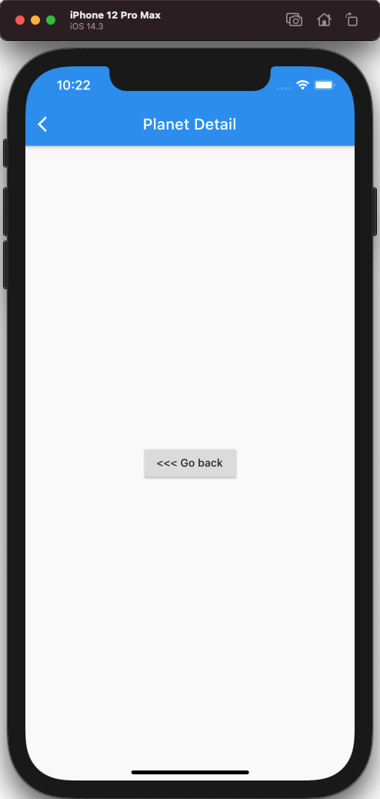
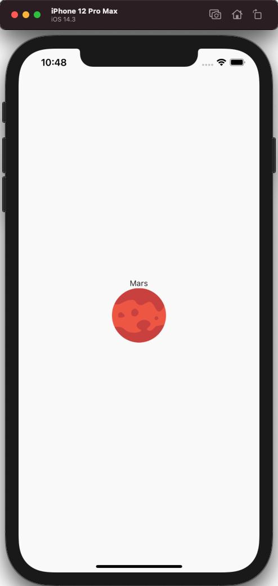
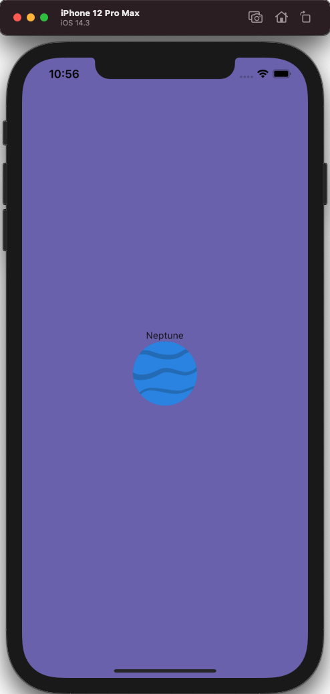

# 路由和导航  
 
## 定义路由  
定义导航的最简单方法是在材料应用程序声明中这样做。例如，如果我们想要为行星详细信息声明一个页面，我们将向材料应用程序对象添加以下内容：  
```dart
class MyApp extends StatelessWidget {
  @override
  Widget build(BuildContext context) {
    return MaterialApp(
      title: "Flutter Demo",
      home: new HomePage(),
      debugShowCheckedModeBanner: false,
      routes: <String,WidgetBuilder>{
        '/detail':(_) => new DetailPage();
      },
    );
  }
}
```
如您所看到的，参数定义了键的字典。每个键都是网页的路径名称。每个项目都包含一个类型的函数，该函数接收当前上下文并返回要作为页面显示的 Widget，本例中为 DetailPage。  
声明路由后，我们可以在单击时将对象导航到此页面。为了做到这一点，我们应该包装我们的整个行小部件在小部件。
从：
```dart
return new Container(
      margin: const EdgeInsets.symmetric(vertical: 16.0, horizontal: 24.0),
      child: new Stack(
        children: <Widget>[
          _planetCard(),
          _planetThumbnail(),
        ],
      ),
    );
```
改：
```dart
return new GestureDetector(
      onTap: () => Navigator.pushNamed(context, "/detail"),
      child: new Container(
        margin: const EdgeInsets.symmetric(vertical: 16.0, horizontal: 24.0),
        child: new Stack(
          children: <Widget>[
            _planetCard(),
            _planetThumbnail(),
          ],
        ),
      ),
    );
```
在这种情况下，我们仅使用 onTap 参数，并为它提供在点击时要执行的函数。  
现在，我们可以创建一个简单的详细信息页面：  
```dart
import 'package:flutter/material.dart';

class DetailPage extends StatelessWidget {
  @override
  Widget build(BuildContext context) {
    return new Scaffold(
      appBar: new AppBar(
        title: new Text("Planet Detail"),
      ),
      body: new Center(
        child: new RaisedButton(
            onPressed: () => Navigator.pop(context),
          child: new Text("<<< Go back"),
        ),
      ),
    );
  }
}
```
这里发生了几件事情。首先，我们创建了一个带 AppBar 的脚手架，如果您执行此代码，您会看到它会自动添加后退按钮，因为它检测到我们当时在辅助页面中（并且它有效！其次，我们创建了一个执行导航器.pop（） 方法的按钮，因此它也返回。

然后，用户有三种方式可以返回：通过后退按钮，通过我们放在屏幕中心的按钮，第三种方法对于 Android 或 iOS 是不同的。对于 Android，手机上的后退按钮工作正常，对于 iOS，左侧轻扫手势工作正常。  
  
## 传递参数
不幸的是，路由表方法不允许我们向新屏幕发送参数（至少开箱即用）。
为了做到这一点，我们需要在Plant中生成我们的Route.
```dart
return new GestureDetector(
onTap: () => Navigator.of(context).push(new PageRouteBuilder(
    pageBuilder: (_, __, ___) => new DetailPage(planet),
    )),
    child: new Container(
    margin: const EdgeInsets.symmetric(vertical: 16.0, horizontal: 24.0),
    child: new Stack(
    children: <Widget>[
    _planetCard(),
    _planetThumbnail(),
    ],
    ),
    ),
);
```
现在，我们需要修改细节页面，以显示一些关于行星收到的东西。
```dart
class DetailPage extends StatelessWidget {
  final Planet planet;

  DetailPage(this.planet);

  @override
  Widget build(BuildContext context) {
    return new Scaffold(
      body: new Container(
        constraints: new BoxConstraints.expand(),
        child: new Column(
          mainAxisAlignment: MainAxisAlignment.center,
          children: <Widget>[
            new Text(planet.name),
            new Image.asset(planet.image, width: 96.0, height: 96.0,),
          ],
        ),
      )
    );
  }
}
```
并且在main.dart中去除路由～  

## 添加Hero  
`Hero`是一个小部件，用于在屏幕之间执行简单的动画。要使用它，只需做这两个小的变化。  
在 `PlanetRow` 类中，修改：`planetThumbnail`  
```dart
return Container(
  margin: EdgeInsets.symmetric(vertical: 16.0),
  alignment: FractionalOffset.centerLeft,
  child: new Hero(
      tag: "planet-hero-${planet.id}",
      child: new Image(
        image: new AssetImage(planet.image),
        height: 92.0,
        width: 92.0,
      ),)
);
```  
现在我们在行星细节页面上也这样做。 
```dart
class DetailPage extends StatelessWidget {
  final Planet planet;

  DetailPage(this.planet);

  @override
  Widget build(BuildContext context) {
    return new Scaffold(
      body: new Container(
        color: const Color(0xFF736AB7),
        constraints: new BoxConstraints.expand(),
        child: new Column(
          mainAxisAlignment: MainAxisAlignment.center,
          children: <Widget>[
            new Text(planet.name),
            new Hero(
                tag: "planet-hero-${planet.id}",
                child: new Image.asset(planet.image, width: 96.0, height: 96.0,)),
          ],
        ),
      )
    );
  }
}
```  
